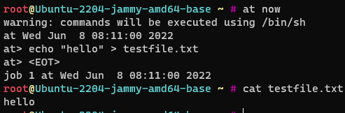
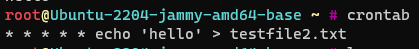
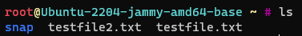

# Linux

## Laboratory Work #8

#### 1. Какая команда позволяет установить задания планировщика?

`at`

#### 2. Что сделает Команда atrm 7?

Удалит задачу с седьмым идентификатором.

#### 3. Какая команда позволяет установить планировщику crontab задания из файла jobs?

`crontab jobs`

#### 4. Когда будет готово задание 19 */2 13 * 5 job.sh ? (13 пятницу на 19-ой минуте каждого второго часа)

В 13 пятницу на 19-ой минуте каждого второго часа

#### 5. Напишите cron строку установленной на выполнение скрипта job.sh с января по май, в 01:00 по воскресеньям  (0 1 * 1-5 7 job.sh)

`0 1 * 1-5 7 job.sh`

#### 6. Просмотреть список всех смонтированных разделов можно командой?

`mount`

#### Задание 1:

Продемонстрировать работу at по запуску задачи записи в файл произвольной строки продемонстрировать работу cron по
запуску задачи записи в файл произвольной строки

Скрин 1.

Скрин 2.

Скрин 3.

