# Linux

## Laboratory Work #2.1

#### 1. Продемонстрировать работу команд:
`cat`, `ls`, `cp`, `mv`, `touch`, `rm`, `echo`, `cd`, `mkdir`, `rmdir`, `grep`,
`less`, `pwd`, `diff`, `file`, `find`, `locate`, `head`, `tail`, `sort`

- `cat <file>`

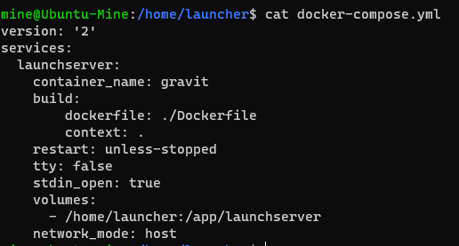

- `ls`

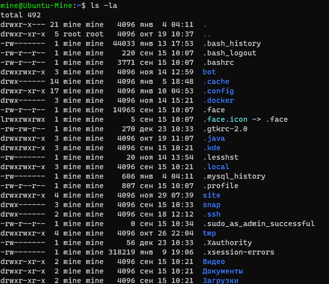

- `cp <object> <dst>`

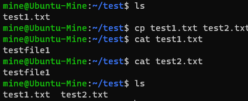

- `mv <object> <dst>`

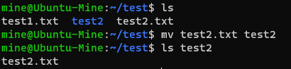

- `touch <name>`

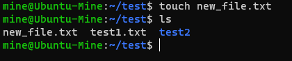

- `rm <object>`

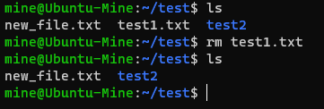

- `echo <command>`

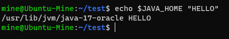

- `cd <dir>`

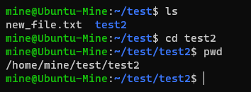

- `mkdir <name>`

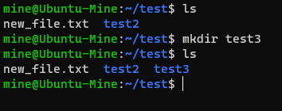

- `rmdir <name>`

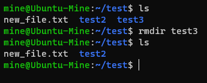

- `grep`

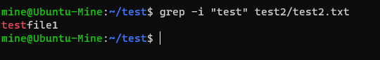

- `less`

command: `ls -la ~/ | less`

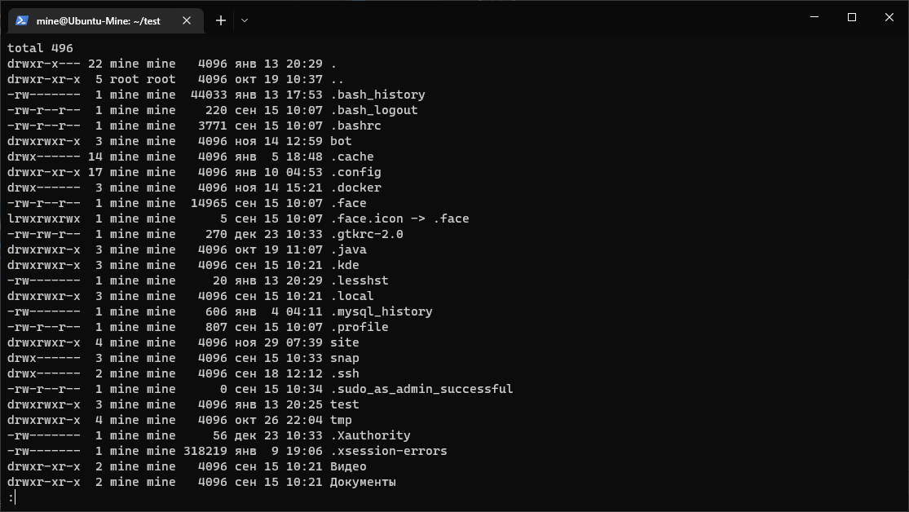

- `pwd [object]`

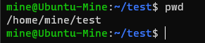

- `diff <object1> <object2>`

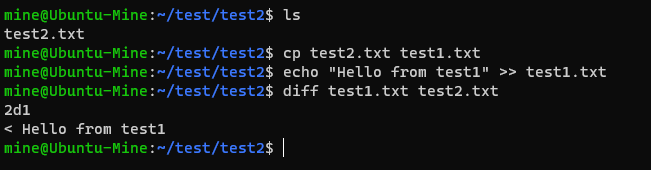

- `file <object>`

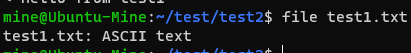

- `find [path]`

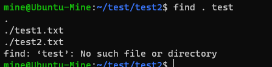

- `locate <patern>`

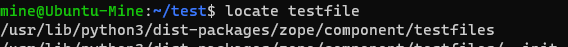

- `head <object>`

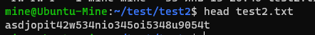

- `tail <object>`

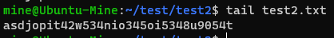

- `sort <object>`

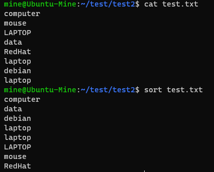

#### 2. Показать содержимое path, добавить в path дополнительный путь.

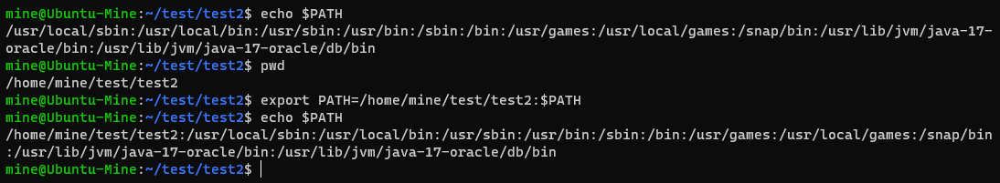

#### 3. Продемонстрировать перенаправление вывода в файл.

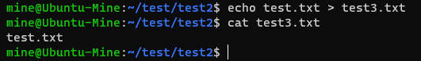

#### 4. Вызвать команду с ошибкой и перенаправить вывод ошибки

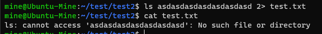

#### 5. Перенаправить стандартный ввод в программу

command: `ls | less`

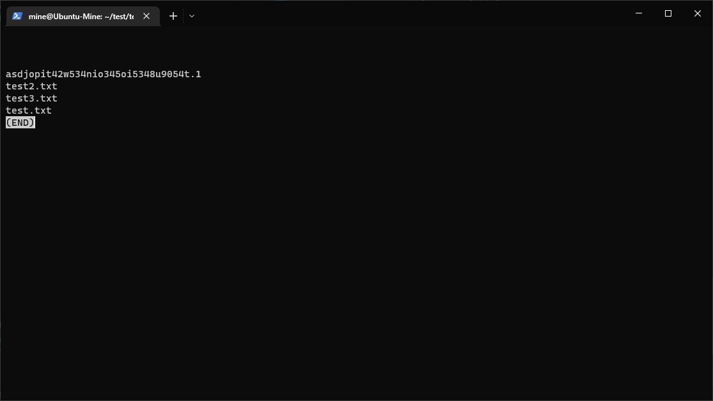

#### 6. Создать архив, распаковать архив

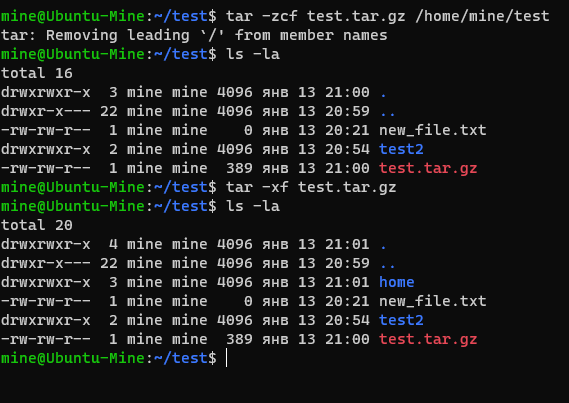